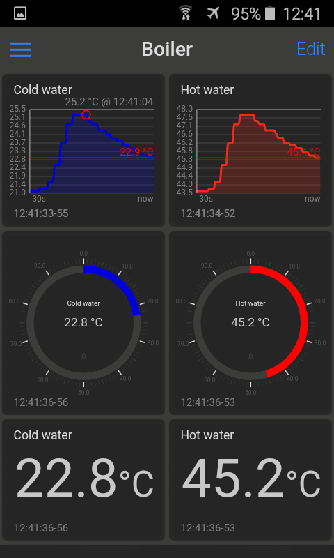

[](LICENSE)
[](https://github.com/VPavlusha/ESP32_WiFi_OneWire_MQTT/actions/workflows/cpp-linter.yml)
[](https://github.com/VPavlusha/ESP32_WiFi_OneWire_MQTT/releases)
[](https://stand-with-ukraine.pp.ua)
[](https://stand-with-ukraine.pp.ua)
---

# ESP32 Wi-Fi OneWire MQTT
The ESP32 WiFi OneWire MQTT project is a simple way to read the data from DS18B20 temperature sensors connected to an ESP32 microcontroller, and send the data to an MQTT broker over Wi-Fi.<br/>
Based on: https://github.com/espressif/esp-idf

#### Table of Contents
&emsp;[1. Features](#1-features)  
&emsp;[2. Monitor And Control Your Project](#2-monitor-and-control-your-project)  
&emsp;[3. Getting Started](#3-getting-started)  
&emsp;[4. Contributing](#4-contributing)  
&emsp;[5. License](#5-license)  

## 1. Features
  - ESP-IDF v5.0.2
  - Reading temperature data from a DS18B20 sensor using the OneWire protocol.
  - Sending temperature data to an MQTT broker over Wi-Fi.
  - Easy-to-use API for customizing the firmware to meet your specific needs.
  - Used Wi-Fi, OneWire, DS18B20, MQTT technology.
  - Written in C language.
  - MIT License.

## 2. Monitor And Control Your Project


You have the ability to monitor and control your Internet of Things (IoT) projects with some app like [IoT OnOff](https://www.iot-onoff.com/).

## 3. Getting Started
To get started with the ESP32 WiFi OneWire MQTT project, you'll need an ESP32 microcontroller, a DS18B20 temperature sensor, and access to an MQTT broker. You'll also need to install the ESP-IDF development framework.

### 3.1 Clone the project repository:
```C
    git clone https://github.com/VPavlusha/ESP32_WiFi_OneWire_MQTT.git
```
### 3.2 Customize the firmware to match your Wi-Fi, DS18B20 and MQTT settings:
  - Edit the **main/Kconfig.projbuild** file with your Wi-Fi, DS18B20 and MQTT settings.

The ESP32 WiFi OneWire MQTT firmware is designed to be easily customizable. You can use the provided API to change the MQTT topic, adjust the temperature DS18B20 port connections, Wi-Fi settings and more.

### 3.3 Build the project:
```C
    cd ESP32_WiFi_OneWire_MQTT
    idf.py build
```
### 3.4 Flash onto your ESP32 microcontroller:
```C
    idf.py -p PORT [-b BAUD] flash
```
Replace PORT with your ESP32 board’s serial port name.
You can also change the flasher baud rate by replacing BAUD with the baud rate you need. The default baud rate is 460800.<br/>
### 3.5 Monitor the output:
```C
    idf.py -p <PORT> monitor
```
Do not forget to replace PORT with your serial port name.

### 3.6 Check Wi-Fi network and MQTT broker:
  - Check the output on the serial monitor to verify that the ESP32 is connecting to your Wi-Fi network and MQTT broker.
  - Check your MQTT broker to verify that temperature data is being sent.

More information how to build project: [ESP-IDF Programming Guide](https://docs.espressif.com/projects/esp-idf/en/v5.0.2/esp32/get-started/start-project.html).

## 4. Contributing
Contributions to the ESP32 WiFi OneWire MQTT project are welcome. If you find a bug or have a feature request, please submit an issue on the project's GitHub page. If you'd like to contribute code, please submit a pull request.

## 5. License
The ESP32_WiFi_OneWire_MQTT project is licensed under the MIT License. See the [MIT license] file for more information.
  
  [MIT license]: http://www.opensource.org/licenses/mit-license.html
